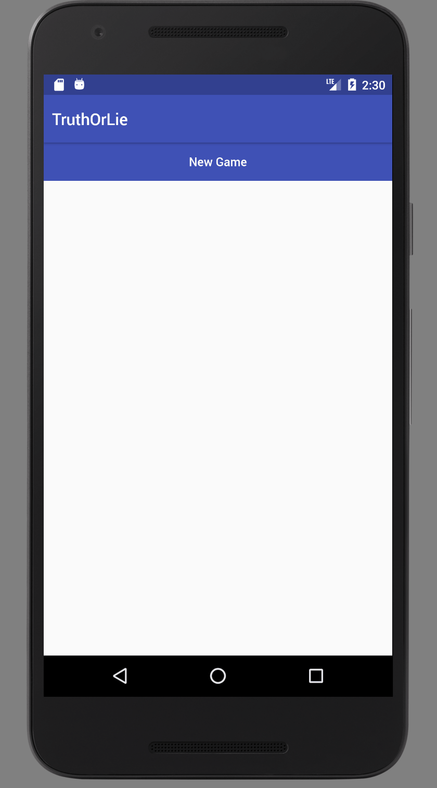

# Truth or Lie

## Demo


## Setup

The application is built with React Native targeting iOS and Android.
Follow the instructions [here](https://facebook.github.io/react-native/docs/getting-started.html#content)
to install the required applications for your platform.

## Running

### Install Dependencies

```sh
$ npm install
```

### Link Dependencies

```sh
$ react-native link
```

### Run JS server

Open up a new terminal window and run the following command in the project directory:

```sh
$ react-native start
```

### Build application

Make sure that the Android emulator is running.
Then, open up a new terminal window and run the following command in the project directory:

```sh
$ react-native run-android
```